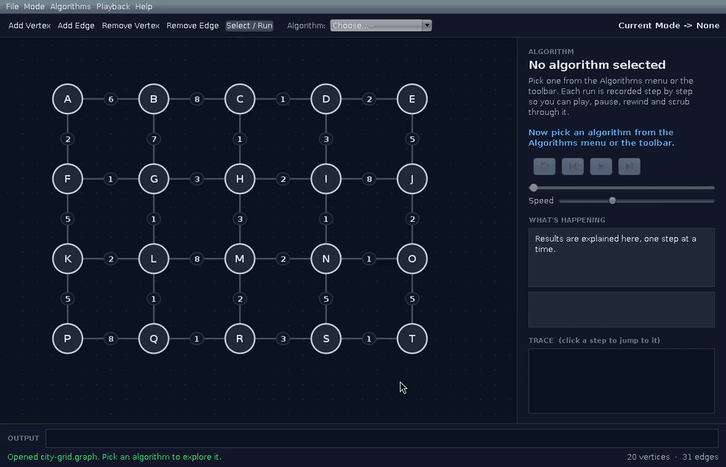
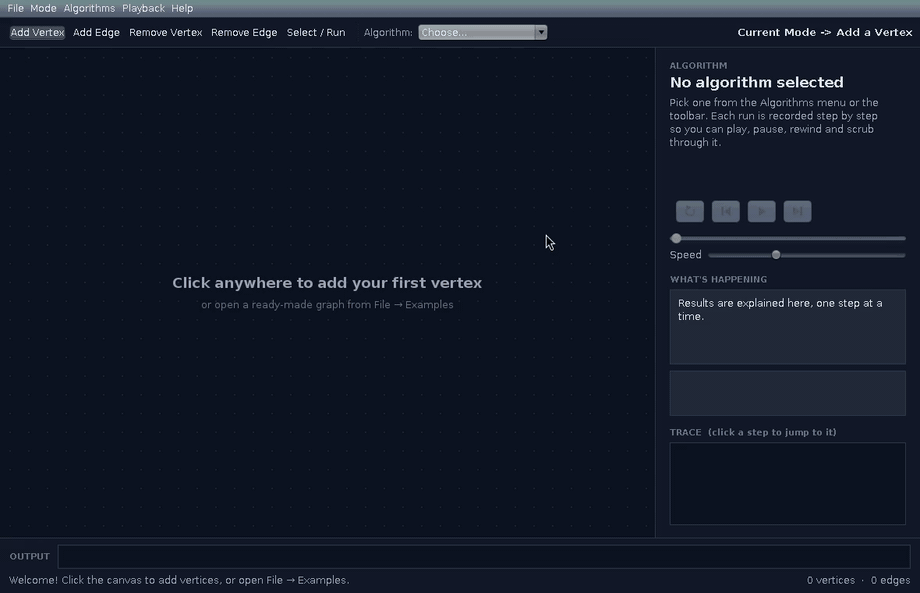
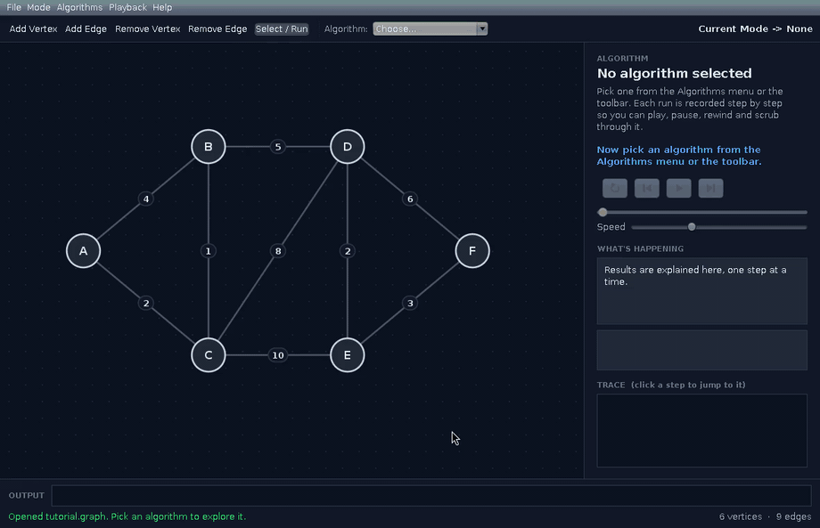
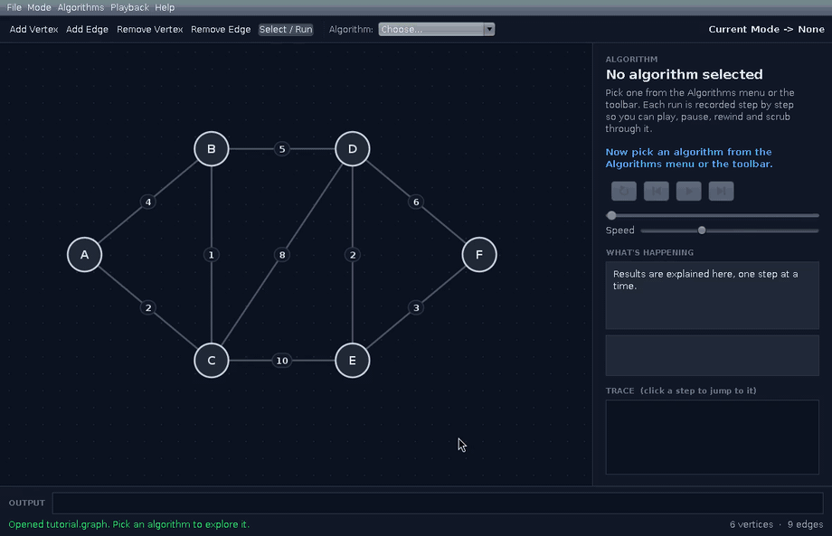
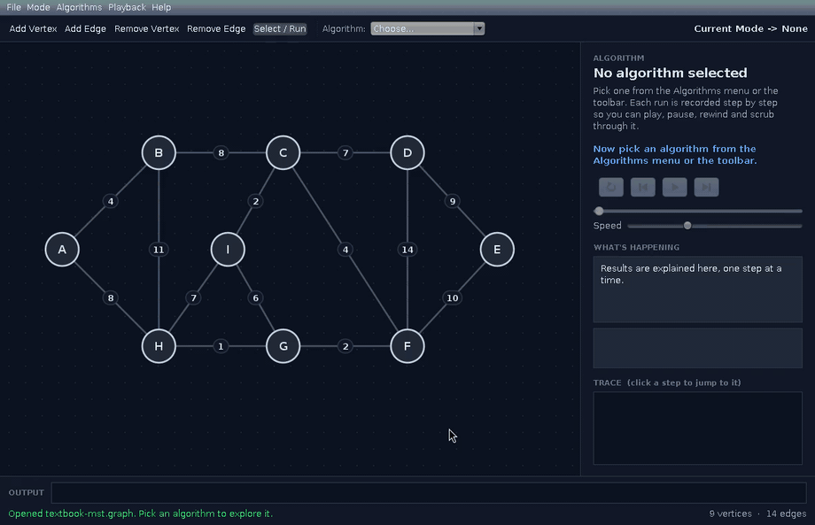
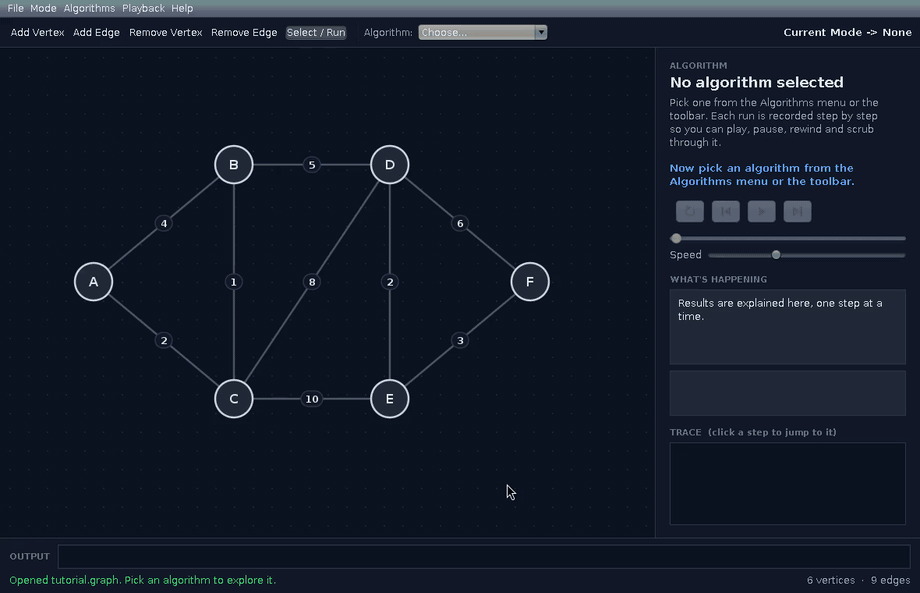
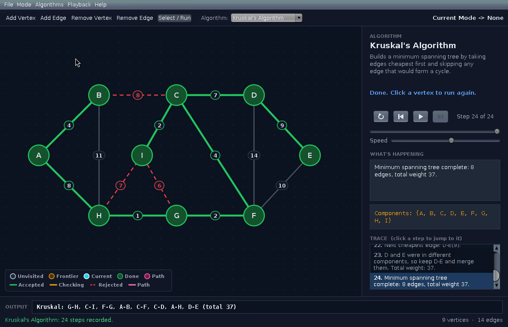
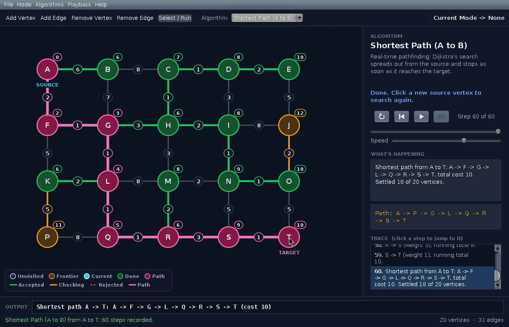
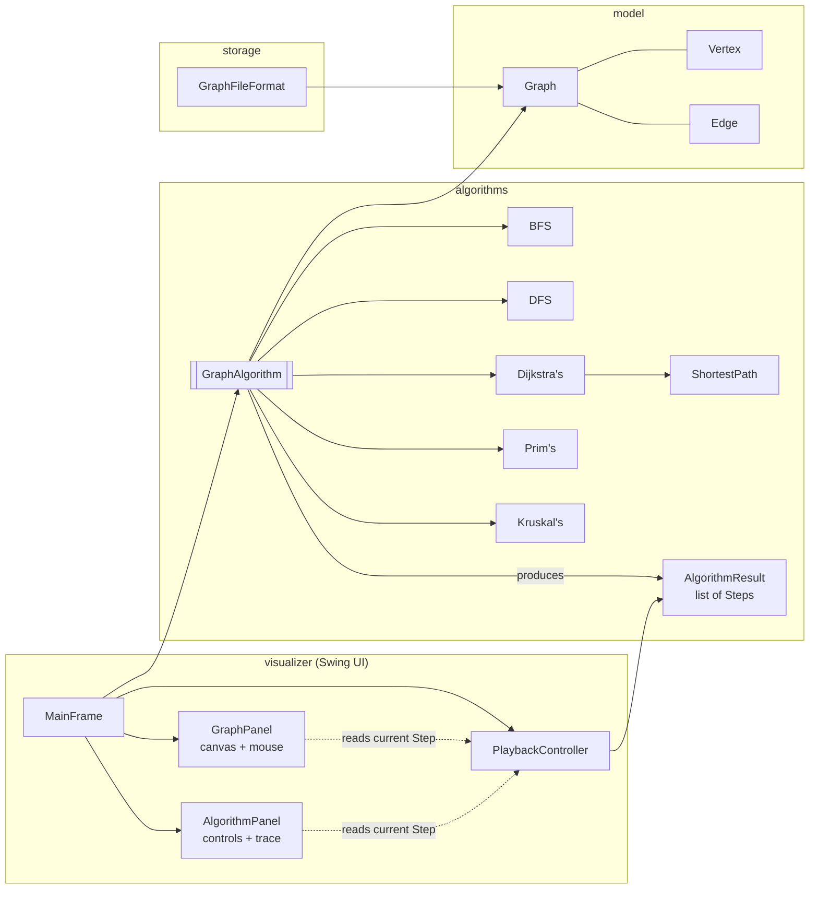

# Graph Algorithms Visualizer

An interactive Java 21 Swing application for drawing weighted graphs and watching graph algorithms run on them **one step at a time**: BFS, DFS, Dijkstra's, real-time source-to-target pathfinding, Prim's and Kruskal's.



*Dijkstra's search spreading outwards from A, stopping the moment it settles T, then tracing the cheapest route.*

---

## Contents

- [The problem it solves](#the-problem-it-solves)
- [Features](#features)
- [How to run it](#how-to-run-it)
- [Usage guide](#usage-guide)
- [How it works](#how-it-works)
- [What changed from the starter project](#what-changed-from-the-starter-project)
- [Testing](#testing)
- [Skills and technologies](#skills-and-technologies)
- [Portfolio reflection](#portfolio-reflection)
- [Ideas for the future](#ideas-for-the-future)

---

## The problem it solves

Graph algorithms are usually taught with a static diagram and a final answer such as `A=0, B=3, C=2`. The answer tells you *what* the algorithm produced but not *why*: which vertex it chose next, which edges it compared, or why it rejected an edge.

This application records every decision an algorithm makes and replays it like a video. You can pause on any step, rewind, and read a plain-English explanation alongside the live state of the queue, stack or priority queue. The final output still matches the classic format, so it can be checked against hand-worked answers.

---

## Features

### Build and edit graphs



- **Add vertices** by clicking the canvas. The next free ID is suggested, so pressing Enter is enough.
- **Add edges** by clicking two vertices or by **dragging** from one to the other. A dashed guide line follows the mouse.
- **Drag vertices** to tidy the layout. Edges follow, and any algorithm result stays on screen.
- **Edit a weight** by double-clicking an edge, or through the right-click menu.
- **Clear error messages** for duplicate IDs, self-loops, duplicate edges, invalid weights and vertices placed too close together.

### Step-by-step traversal (BFS and DFS)



Vertices change colour as they move from *unvisited* to *frontier* to *current* to *done*. Each vertex shows its visit order. The side panel shows the BFS **queue** and the DFS **recursion stack**, so DFS backtracking is visible rather than implied.

### Real-time pathfinding (new)

Choose **Shortest Path (A to B)**, click a source and then a target. Tentative distances update on every vertex as Dijkstra's relaxes edges. Amber edges show the best-known route to each frontier vertex. The search **stops early** once the target is settled, and the winning path is drawn from the source (see the GIF at the top).

### Hover to trace any path



After a full Dijkstra's (or BFS) run, hovering over any vertex highlights its path from the start, with its total cost (or hop count for BFS).

### Minimum spanning trees: Prim's and Kruskal's (Kruskal's is new)



**Kruskal's** sorts every edge and uses a union-find structure to skip edges that would form a cycle. Rejected edges stay dashed red so you can see why they were skipped. On a disconnected graph it builds a spanning forest. **Prim's** grows one tree from the start vertex and highlights every candidate edge before choosing the cheapest. Both reach the known answer of **37** on the classic example from *Introduction to Algorithms* (Cormen et al., Fig. 23.1).

### Playback controls



Play or pause, step forwards and backwards, restart, skip to the result, change the speed, drag the scrubber, or click any line in the trace to jump to that step.

### Files and examples

- **Save and open** graphs as readable `.graph` text files. A broken file is rejected with its line number, and the current graph is left untouched.
- **Four bundled examples** under *File → Examples*: a tutorial graph, a 20-junction city grid, the textbook MST graph, and a disconnected "two islands" graph.
- **Export as PNG** saves the canvas as an image. Saving asks before replacing an existing file.
- **Small screens:** the window never opens larger than the screen, and graphs drawn on a bigger screen are pulled into view when opened (or press `Ctrl+F`).

<p align="center">
  
  
</p>

---

## How to run it

**Requirements:** JDK 21 or newer. Maven is bundled with NetBeans and IntelliJ IDEA.

### NetBeans

1. *File → Open Project* and select the folder containing `pom.xml`.
2. Right-click the project and choose **Run**. The main class `visualizer.GraphVisualizer` is set in the POM.
3. To run the tests, right-click the project and choose **Test**.

### IntelliJ IDEA

1. *File → Open* and select `pom.xml`, then choose **Open as Project**.
2. Open `src/main/java/visualizer/GraphVisualizer.java` and click the green run arrow.
3. To run the tests, right-click `src/test/java` and choose **Run 'All Tests'**.

### Command line

```bash
git clone https://github.com/<your-username>/graph-algorithms-visualizer.git
cd graph-algorithms-visualizer
mvn test                      # run the unit tests
mvn compile exec:java         # launch the app
mvn package                   # build target/graph-algorithms-visualizer-2.0.0.jar
java -jar target/graph-algorithms-visualizer-2.0.0.jar
```

You can pass a graph file to open it on start-up:
`java -jar target/graph-algorithms-visualizer-2.0.0.jar my-graph.graph`

---

## Usage guide

### Modes

| Mode | What a click does |
|---|---|
| **Add a Vertex** | Click empty space to add a vertex. |
| **Add an Edge** | Click two vertices (or drag between them), then enter a weight from -9999 to 9999. |
| **Remove a Vertex** | Deletes the vertex and every edge attached to it. |
| **Remove an Edge** | Deletes the edge you click. |
| **None** (*Select / Run*) | Clicking a vertex picks the start for the chosen algorithm. |

Modes are available from the **Mode** menu, the toolbar, or `Ctrl+1` to `Ctrl+5`. You can drag vertices in every mode except the two Remove modes. Right-click anything for a context menu.

### Running an algorithm

1. Build a graph, or open one from *File → Examples*.
2. Pick an algorithm from the **Algorithms** menu or the toolbar drop-down. This switches to *None* mode, as in the original project.
3. Click a start vertex. **Shortest Path** needs a second click for the target. **Kruskal's** runs immediately because it works on the whole graph.
4. Watch it play, or take control with the playback buttons.

Dijkstra's refuses to run on negative weights and explains why, because it gives wrong answers with them. Prim's and Kruskal's accept negative weights.

### Keyboard shortcuts

| Key | Action |
|---|---|
| `Space` | Play / pause |
| `←` / `→` | Step back / forward |
| `Home` / `End` | Restart / skip to the result |
| `[` / `]` | Slower / faster |
| `Esc` | Cancel a half-drawn edge or a pending source |
| `Ctrl+F` | Fit the graph to the window (useful on small screens) |
| `Ctrl+N` / `Ctrl+O` / `Ctrl+S` | New / open / save |
| `F1` | In-app help |

### Output format

The output bar shows the final result, and you can select the text to copy it:

```
BFS: A -> C -> B -> D -> E -> F
DFS: A -> C -> B -> D -> E -> F
Dijkstra: A=0, B=3, C=2, D=8, E=10, F=13
Shortest path A -> F: A -> C -> B -> D -> E -> F (cost 13)
Prim: B=C, C=A, D=B, E=D, F=E              (child=parent, sorted by child)
Kruskal: B-C, A-C, D-E, E-F, B-D (total 13) (edges in the order accepted)
```

Neighbours are explored lowest weight first, with ties broken alphabetically, so every run gives the same result.

---

## How it works



**Recording, not animating.** Each algorithm runs to completion straight away and records a list of immutable `Step` snapshots. Each snapshot holds the colour of every vertex and edge, the labels, an explanation, and the data-structure contents. The UI never re-runs an algorithm; `PlaybackController` just moves an index through the list. That is why stepping *backwards* costs nothing, and why the algorithms can be unit-tested without a GUI.

**Strategy pattern.** Every algorithm implements `GraphAlgorithm`. The `Algorithm` enum pairs each menu entry with its implementation, so adding a new algorithm means writing one class and adding one line.

**Separate model and view.** `Vertex`, `Edge` and `Graph` are plain Java objects with no Swing code. `GraphPanel` paints them with `Graphics2D`.

| Package | Responsibility |
|---|---|
| `model` | `Graph` (owns vertices, edges and adjacency lists; validates edits), `Vertex`, `Edge` |
| `algorithms` | Five algorithms plus the shortest-path variant, `Step` snapshots, `AlgorithmResult`, union-find |
| `visualizer` | The window, canvas, side panel, playback engine and theme |
| `storage` | `.graph` text format: save, load and bundled examples |

---

## What changed from the starter project

### Bugs fixed

| Problem in the starter code | Fix |
|---|---|
| Dijkstra's on a single-vertex graph threw `StringIndexOutOfBoundsException` | Output is built safely; covered by a regression test |
| `Edge.equals` treated A-B and B-A as equal, but `hashCode` did not, breaking the equals/hashCode contract | One undirected edge per connection, with a symmetric `hashCode` (regression test) |
| `Vertex.equals` compared x/y, so moving a vertex would break every `HashMap` lookup | Identity is the ID only (regression test) |
| `pom.xml` targeted Java 25 and pointed to a main class that doesn't exist | Java 21, `visualizer.GraphVisualizer` |
| A weight above 2,147,483,647 passed the input check, then crashed `Integer.valueOf` | Weights are limited to -9999 to 9999 and checked in the model, so loaded files are checked too (tested) |
| DFS continued into other components in `HashMap` order, so output varied between runs | DFS visits the start's component only, like BFS; ties are broken alphabetically |
| Dijkstra's accepted negative weights and gave wrong answers | Negative weights are refused with an explanation |
| Edges could only be clicked within about 2 pixels | Hit-testing within 7 pixels using point-to-segment distance |
| `Collections.sort(graph.get(v))` reordered the graph's own lists as a side effect | Sorting works on a copy (tested) |

### Design changes

| Starter project | This version |
|---|---|
| Three `static` collections (`Vertex.vertices`, `Edge.edges`, `Graph.availableEdges`) kept in sync by hand | A single `Graph` instance owns all state |
| `Vertex` was a `JPanel` and `Edge` a `JComponent` | Plain model classes in `model`; the canvas paints them |
| The `Graph` panel class was also the data holder | Renamed to `GraphPanel`; drawing and input only |
| `AlgorithmSetter` wrapped the strategy | Removed; the `Algorithm` enum holds the strategy directly |
| A one-second timer showed "Please wait..." before the answer | Real step-by-step playback with controls |
| Each edge stored twice (A→B and B→A) | One undirected `Edge`; `other(vertex)` walks it from either end |
| Output formats varied between algorithms | Consistent `Name: result` format; Dijkstra's includes the start (`A=0`) as in the brief |

---

## Testing

**44 JUnit 5 tests** in `src/test/java`, runnable with `mvn test` or from the IDE:

| Test class | Covers |
|---|---|
| `GraphTest` (11) | Validation, weight limits, removal cascades, equals/hashCode regression, change listeners, hit-testing |
| `TraversalTest` (7) | BFS and DFS order, components, isolated vertices, BFS paths, no side effects |
| `ShortestPathTest` (9) | Distances, ∞ for unreachable vertices, the single-vertex crash, negative weights, early stopping, path reconstruction |
| `SpanningTreeTest` (8) | Output formats, the textbook weight of 37, cycle rejection, spanning forests |
| `PlaybackDataTest` (4) | Snapshots are immutable and independent; every step has an explanation |
| `GraphFileFormatTest` (5) | Round-trip save/load, line-numbered errors, broken files don't partially load, all examples load |

Two tests compare against an independent method on **50 random graphs** each (fixed seeds, so failures are reproducible):

- Dijkstra's against **Floyd-Warshall**
- Prim's against **Kruskal's** (total weight)

Hand-picked examples can miss edge cases that random graphs catch.

---

## Skills and technologies

**Technologies:** Java 21 (records, switch expressions, pattern matching for `instanceof`, text blocks), Swing and Java2D, Maven, JUnit 5, Git and GitHub. No runtime dependencies.

**Skills applied:**

- **GUI development:** custom painting with antialiasing, event handling (click, drag, hover, double-click, context menus, key bindings), a custom Nimbus dark theme, vector icons.
- **Data structures:** adjacency lists, queues, stacks (via recursion), priority selection, union-find with path compression and union by size.
- **Algorithms:** BFS, DFS, Dijkstra's (with early exit and path reconstruction), Prim's, Kruskal's, Floyd-Warshall (as a test oracle).
- **Software design:** separating model and view, Strategy pattern, immutable snapshots, the observer pattern for UI updates, keeping behaviour deterministic so it can be tested.
- **Testing and debugging:** regression tests for each fixed bug, cross-checking against an independent algorithm, fixed-seed randomised tests.

---

## Portfolio reflection

<!-- TODO(Caleb): rewrite this section in your own words before submitting. It is a starting draft only. -->

**Why this is a strong portfolio piece.** It shows more than "I can implement Dijkstra's." It starts from someone else's working-but-flawed code, diagnoses concrete bugs, and redesigns the structure so new features become easy to add. That is much closer to day-to-day software work than a greenfield exercise. The GIFs show the result in seconds, the tests show it is correct, and the "What changed" tables make the engineering decisions easy to review.

**What I learned.**

- Where state lives matters more than it looks. The starter project's static collections worked until any feature needed them to stay in sync, such as removing a vertex, starting a new graph, or dragging.
- `equals` and `hashCode` are a contract. Breaking it doesn't cause an error; it just makes hash-based collections quietly misbehave.
- Recording an algorithm's steps, instead of animating it live, made both the UI and the tests simpler.
- Checking an algorithm against a different one on random inputs builds far more confidence than a few hand-picked examples.

---

## Ideas for the future

- **A\* search.** It needs a heuristic that never overestimates the remaining cost. Here, edge weights are typed in by hand and have nothing to do with on-screen distance, so straight-line distance would be a wrong heuristic. A* would need an option to derive weights from vertex positions first.
- **Directed graphs**, which would make Bellman-Ford (negative weights) and topological sort meaningful. In an undirected graph, any negative edge already forms a negative cycle.
- Undo/redo, auto-layout, and a side-by-side runtime comparison view.

---

*Built on the Graph Algorithms Visualizer starter project provided for the IIE ICE task, extended by Caleb Pryce.*
